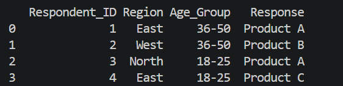
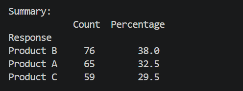
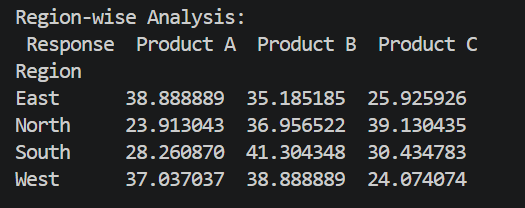
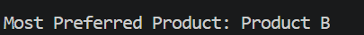
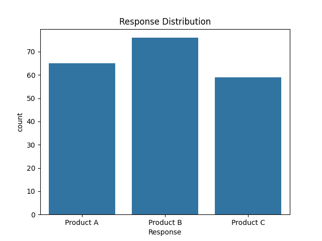
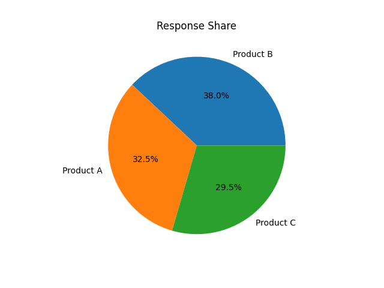
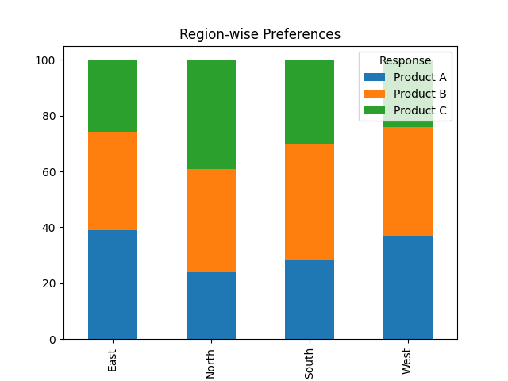
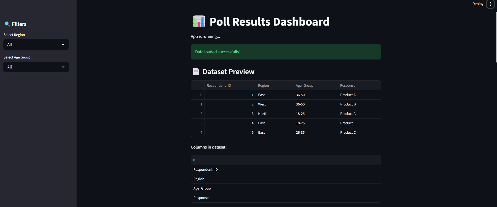
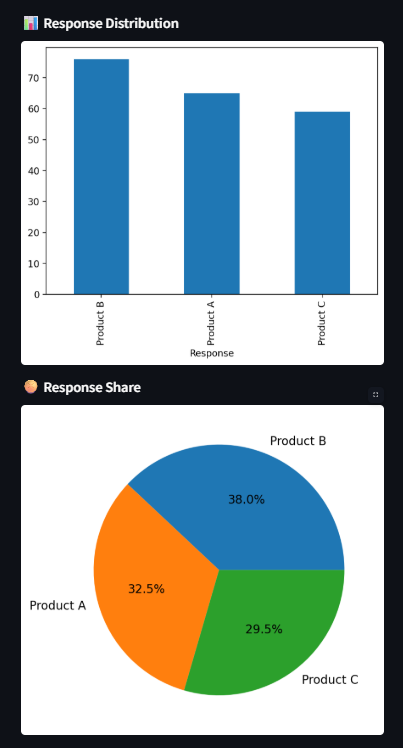
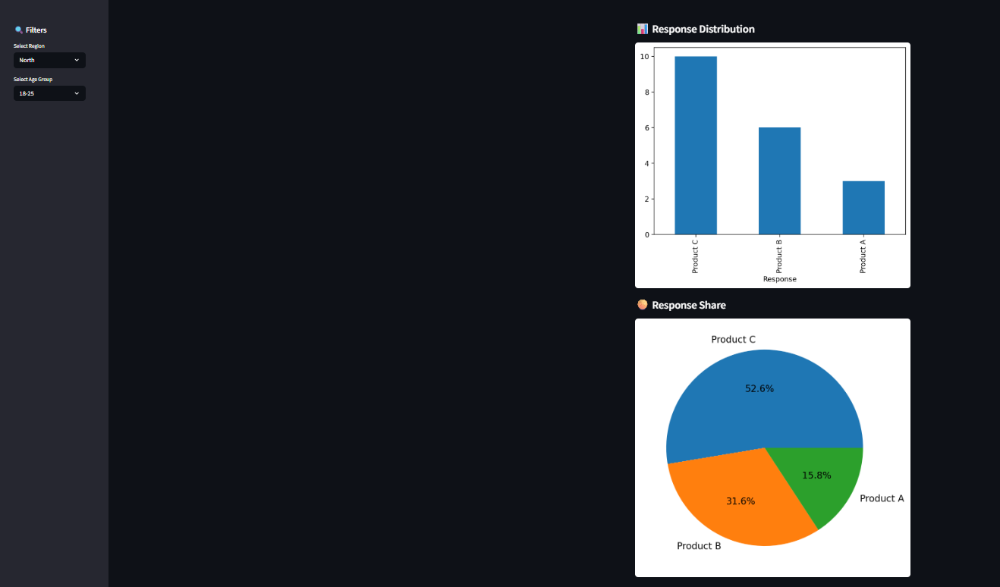

# 📊 Poll Results Visualizer


## 🚀 Overview

The Poll Results Visualizer is a data analytics project that transforms raw survey or poll data into meaningful insights using Python.

It helps analyze responses, identify trends, and visualize results through charts.

---

## ❗ Problem Statement

Raw poll data is difficult to interpret.

- No clear visualization  
- Hard to analyze manually  
- Time-consuming to extract insights  

---

## 💡 Solution

This project:

- Generates synthetic poll data  
- Cleans and processes data  
- Calculates response percentages  
- Performs region-wise analysis  
- Visualizes data using charts  
- Generates meaningful insights  

---

## 🎯 Features

- Data cleaning and preprocessing  
- Percentage calculation  
- Region-wise comparison  
- Bar chart visualization  
- Pie chart visualization  
- Insight generation  

---

## 🛠 Tech Stack

- Python  
- Pandas  
- NumPy  
- Matplotlib  
- Seaborn  

---
## 📂 Project Structure

```
Poll-Results-Visualizer/
├── data/
│   └── poll_data.csv
├── outputs/
│   ├── bar_chart.png
│   ├── pie_chart.png
│   └── region_chart.png
├── images/
│   ├── dataset_preview.png
│   ├── summary_table.png
│   ├── region_analysis.png
│   └── final_insight.png
├── main.py
├── requirements.txt
└── README.md
```


---

## ⚙️ Installation

```bash
git clone https://github.com/needhi-x/Poll-Results-Visualizer.git
cd Poll-Results-Visualizer
```

```bash
python -m venv venv
```

```bash
venv\Scripts\activate
```

```bash
pip install -r requirements.txt
```

---

## ▶️ How to Run

```bash
python main.py
```

---

## 📊 Outputs

### 📊 Dataset Preview


Displays the first few rows of the generated poll dataset, including respondent ID, region, age group, and selected response.

### 📊 Summary Table


Shows the total count and percentage distribution of each response, helping identify the most preferred option.


### 🌍 Region-wise Analysis


Provides a comparative view of response distribution across different regions, highlighting regional preferences and trends.

### Final Insight


Displays the most preferred product based on overall responses, representing the final outcome of the analysis.

---

## 📈 Visualizations

### 📊 Bar Chart


Visualizes the count of responses for each product, making it easy to compare overall popularity.

### 🥧 Pie Chart


Represents the percentage share of each response, providing a quick overview of distribution.

### 📊 Region-wise Chart


Display a stacked comparison of product preferences across regions, enabling deeper analysis of regional behaviour

---
## 🌐 Streamlit Dashboard

### 📊 Dashboard Overview


Displays the main interface including dataset preview and filter options.

---

### 📈 Charts Visualization


Shows bar and pie charts representing response distribution.

---

### 🔍 Filters Applied


Demonstrates how the dashboard updates dynamically based on selected filters.

---

## 🔍 Insights

- Product B is the most preferred product  
- Regional differences exist in responses  
- Data visualization improves understanding  

---

## 🚀 Future Improvements

- Streamlit dashboard  
- Real-time data integration  
- Google Forms data support  
- Advanced analytics  

---

## 👩‍💻 Author

Nidhi Apotikar  

⭐ If you found this project useful, consider giving it a star!
