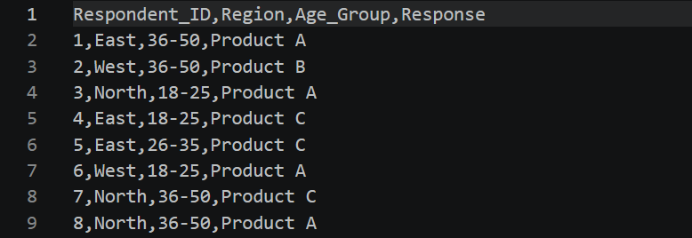
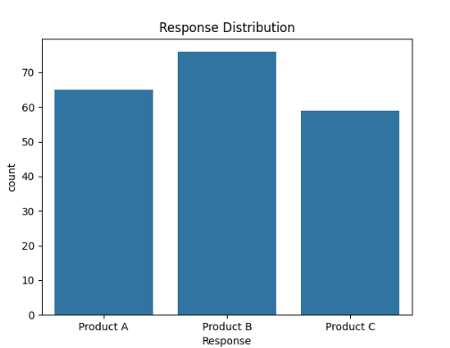
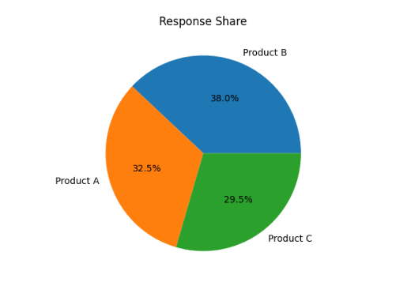
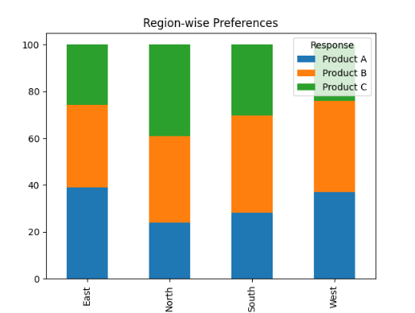

## 📊 Poll Results Visualizer
## 🚀 Overview
- The Poll Results Visualizer is a data analytics project that processes poll/survey data and transforms it into meaningful insights using Python.
- It simulates real-world scenarios where organizations analyze survey responses to understand user preferences, trends, and patterns.

## ❗ Problem Statement
- Raw poll or survey data is often difficult to interpret. Without proper analysis, it becomes challenging to extract useful insights for decision-making.

## 💡 Solution
### This project:
- Generates synthetic poll data
- Cleans and processes the dataset
- Performs response analysis
- Calculates percentage distribution
- Conducts region-wise comparison
- Visualizes results using charts
- Provides actionable insights

## 🎯 Objectives
- Analyze poll/survey data efficiently
- Identify trends and patterns
- Perform comparative analysis
- Build a professional data analytics project

## 🛠️ Tech Stack
- Language: Python
- Libraries:
- Pandas
- NumPy
- Matplotlib
- Seaborn

## 📂 Project Structure
'''
Poll-Results-Visualizer/
|
|-- data/
|   |-- poll_data.csv
|
|-- outputs/
|   |-- bar_chart.png
|   |-- pie_chart.png
|   |-- region_chart.png
|
|-- images/
|   |-- dataset_preview.png
|   |-- summary_table.png
|   |-- region_analysis.png
|   |-- final_insight.png
|
|-- notebooks/
|
|-- src/
|
|-- main.py
|-- requirements.txt
|-- README.md
'''

## ⚙️ Installation & Setup
1️⃣ Clone Repository
git clone https://github.com/needhi-x/Poll-Results-Visualizer.git
cd Poll-Results-Visualizer

2️⃣ Create Virtual Environment
python -m venv venv

3️⃣ Activate Environment
- Windows:
venv\Scripts\activate

- Mac/Linux:
source venv/bin/activate

4️⃣ Install Dependencies
pip install -r requirements.txt

### ▶️ How to Run
 python main.py

## 📊 Features
- ✅ Synthetic poll dataset generation
- ✅ Data cleaning and preprocessing
- ✅ Response count and percentage calculation
- ✅ Region-wise analysis
- ✅ Data visualization using charts
- ✅ Insight generation

## 📈 Outputs
### 🧾 Dataset Preview
Displays initial poll dataset with:
- Respondent ID
- Region
- Age Group
- Response
### 📌 Screenshot:

### 📊 Summary Table
Shows:
- Count of each response
- Percentage distribution
### 📌 Screenshot:

### 🌍 Region-wise Analysis
Compares product preference across regions
### 📌 Screenshot:

### 🧠 Final Insight
Identifies the most preferred product
### 📌 Screenshot:

## 📉 Visualizations
### 📊 Bar Chart
Shows distribution of responses

### 🥧 Pie Chart
Shows percentage share

### 📊 Region-wise Chart
Shows regional comparison

## 🔍 Sample Insights
- Product B is the most preferred product among respondents
- Regional variation exists in product preference
- Different age groups show varied responses

## 🧠 Key Learnings
- Data preprocessing using Pandas
- Aggregation and percentage calculations
- Data visualization techniques
- Real-world survey data analysis workflow

## 💼 Use Cases
- Election poll analysis
- Customer feedback surveys
- Employee satisfaction surveys
- Product preference analysis
- Academic feedback analysis

## 🚀 Future Enhancements
🔹 Interactive dashboard using Streamlit
🔹 Integration with Google Forms data
🔹 Real-time data updates
🔹 Sentiment analysis on text responses
🔹 Power BI dashboard integration

## 👩‍💻 Author
Nidhi Apotikar

⭐ Support
If you found this project useful, consider giving it a ⭐ on GitHub!
